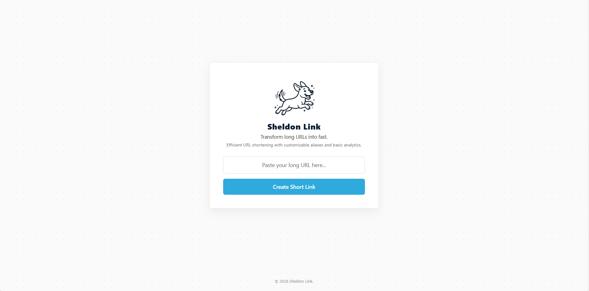

# 🔗 Custom URL Shortener

A lightweight, fast, and fully functional URL shortener built from scratch. 

This project uses core Node.js modules to handle server routing, file serving, and database management. It demonstrates a strong understanding of fundamental backend concepts, clean naming conventions, and asynchronous JavaScript.

## ✨ Features

* **Custom Link Generation:** Automatically generates unique 5-character short codes for any provided URL.
* **Smart Redirection:** Quickly looks up short codes and redirects users to their original destinations.
* **Static File Serving:** Serves HTML and image files directly using the native Node.js File System (`fs`) module.
* **Local Database:** Uses SQLite for fast, lightweight data storage without needing a separate database server.
* **Zero-Dependency Routing:** Handles all API routes and error handling using the native `http` module.

## 🛠️ Tech Stack

* **Language:** JavaScript (ES Modules)
* **Backend:** Node.js (Core `http`, `fs`, `path`, and `url` modules)
* **Database:** SQLite (`sqlite3` package)

## 🚀 Getting Started

Follow these steps to run the project locally on your machine.

### 1. Prerequisites
Make sure you have Node.js installed on your computer. 

### 2. Installation
Clone this project to your local machine, then install the required database package:

npm install sqlite3

### 3. Running the server 
Go to the server folder and use the below command:

node app.js

### Future improvements 
While this project is fully functional, here are a few features that could be added to grow the application over time:
* **Click Analytics:** Track how many times a short link is visited to provide basic data to the user.
* **Custom Short Codes:** Allow users to create custom, readable aliases (e.g., /my-custom-link) instead of random characters.
* **Link Expiration:** Add an option to set an expiration date so links automatically deactivate after a certain time.
* **User Accounts:** Add a simple login system so users can view their link history and manage their active URLs.